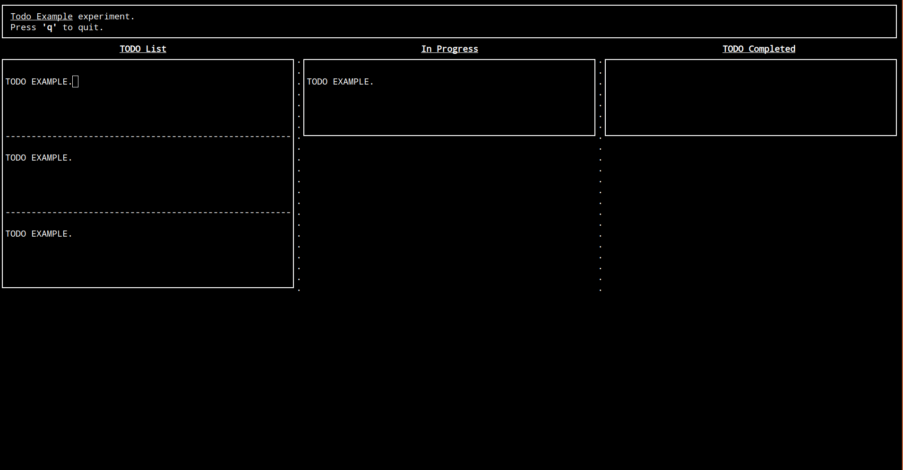

# [Work In Progress] Todo App on Command Line

### Overview
A simple todo app for command line created with `Python` and `prompt-toolkit` library.

#### Current State:
* Has a basic structure of a todo app with three columns of todo list, in progress list, and completed list.
* Largely based on the example code from python-prompt-toolkit repository.

#### TODO:
* [ ] Add functions to `addTodo`, `moveToInProgress`, `moveToCompleted`
* [ ] Get size of terminal screen
* [ ] Improve UI and deisgn (colour and structure)
* [ ] Maybe refactor code into smaller files to manage better
* [ ] (More to come...)
